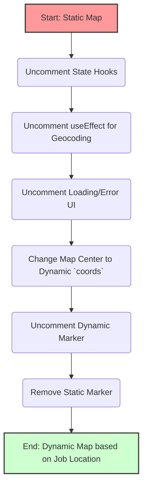

# Plan: Implement Dynamic Job Location Map

This plan outlines the steps to modify the `MapJobFinder.jsx` component to dynamically display the job location based on the provided address string, replacing the current static placeholder map.

## Initial Problem

The Google Map displayed on job detail pages showed a "For development purposes only" watermark. This was resolved by updating billing information in the Google Cloud Platform (GCP) and restarting the development server.

## Enhancement Goal

Modify the map component to use the Google Geocoding API to convert the job's location string (e.g., "South Randi, WA") into coordinates (latitude/longitude) and display the map centered on that location with a marker.

## Prerequisites

*   The `NEXT_PUBLIC_GOOGLE_MAPS_API_KEY` environment variable is correctly set in `.env.local`.
*   The Google Cloud Platform project associated with the API key has:
    *   Active billing enabled.
    *   "Maps JavaScript API" enabled.
    *   "Geocoding API" enabled.
    *   Appropriate API key restrictions (HTTP referrers allowing the development domain, API restrictions allowing the necessary APIs).

## Plan for Modifying `superio/components/job-listing-pages/components/MapJobFinder.jsx`

1.  **Activate State Management:** Uncomment the `useState` hooks (lines 24-27) for `coords`, `loading`, and `error`.
2.  **Enable Geocoding:** Uncomment the `useEffect` hook (lines 29-61) to fetch coordinates using the Geocoding API.
3.  **Add Loading/Error Indicators:** Uncomment the conditional rendering logic (lines 71-73) for user feedback during geocoding.
4.  **Set Map Center Dynamically:** Modify the `<GoogleMapReact>` component (around line 83) to use the `center` prop with the `coords` state variable (uncommenting logic similar to line 82).
5.  **Display Dynamic Marker:** Uncomment the dynamic `<MarkerComponent>` rendering logic (lines 87-93) to place the marker at the fetched `coords`.
6.  **Remove Static Marker:** Remove or comment out the static marker code (lines 94-99).

## Diagram of Changes

## Next Step

Switch to Code mode to apply these changes to the `MapJobFinder.jsx` file.