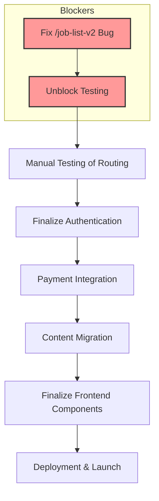

# MyABAJobs Project Recovery & Completion Plan

---

## Phase 1: Fix `/job-list-v2` Bug

- Diagnose why "No jobs found" appears:
  - Review Supabase query in `FilterJobsBox.jsx`.
  - Check browser console for fetch errors or incorrect API calls.
  - Confirm seeded jobs exist in Supabase and match query filters.
  - Add console logs or use React DevTools to trace data flow.
  - Adjust query filters or component logic as needed.
  - Verify job data renders correctly once fixed.

**Status: Completed**

*   **Summary:** Fixed the "No jobs found" bug by correcting the salary filter logic and tag filtering in `FilterJobsBox.jsx`. Added comprehensive debugging logs.

---

## Phase 2: Unblock Testing

**Note:** With the `/job-list-v2` bug fixed, manual testing can now proceed.

- **Automated Testing:**
  - Investigate Puppeteer "detached Frame" errors.
  - If unresolved quickly, **switch to manual testing**.
- **Manual Testing:**
  - Test all public routes:
    - `/job-list-v2` (Jobs)
    - `/employers-list-v1` (Employers)
    - `/blog-list-v1` (Blog)
    - Single Job, Employer, Blog pages
  - After authentication is verified, test protected routes:
    - `/candidates-list-v1` (Applicants)
    - Dashboards
  - Document any broken links, missing data, or UI issues.

---

## Phase 3: Finalize Authentication

- **Verify:**
  - Sign up, login, logout flows.
  - Role-based redirects (candidate vs employer).
  - Middleware protections for dashboards and applicant list.
- **Test:**
  - Candidate dashboard: profile update, certifications, resume upload.
  - Employer dashboard: post job, view applicants.

---

## Phase 4: Payment Integration

- **Choose:** Stripe or PayPal (or both).
- **Implement:**
  - Employer payment flow for job postings.
  - Pricing page updates.
  - Webhook handling for payment status.
- **Test:** End-to-end payment and job posting unlock.

---

## Phase 5: Content Migration

- **Export:** Content from existing WordPress site.
- **Import:** Into Supabase blog tables.
- **Update:** Blog list and detail pages to reflect migrated content.

---

## Phase 6: Finalize Frontend

- **Complete:**
  - Work history display on candidate profiles.
  - Any missing filters or UI components.
  - Polish UI/UX, fix minor bugs.
- **Verify:** All links, data displays, and forms work as expected.

---

## Phase 7: Deployment

- **Configure:** Vercel deployment.
- **Test:** Production environment.
- **Launch:** Publicly.

---

## Visual Plan

---

## Summary

- Backend is largely complete and well-structured.
- Frontend is mostly integrated but blocked by a key bug and testing issues.
- Immediate priority: **fix `/job-list-v2` bug**.
- Then, **unblock testing** (manual if needed).
- After that, **finalize authentication**, **integrate payments**, **migrate content**, **polish frontend**, and **deploy**.

## Testing Instructions

To verify the fix for Phase 1:

1.  Run the development server: `cd superio && npm run dev`
2.  Navigate to `/job-list-v2` in your browser.
3.  Verify that jobs are now displayed correctly.
4.  Check the browser console for debugging logs to ensure the query is working as expected.
5.  Test different filter combinations (salary, tags, etc.) to ensure they function correctly.